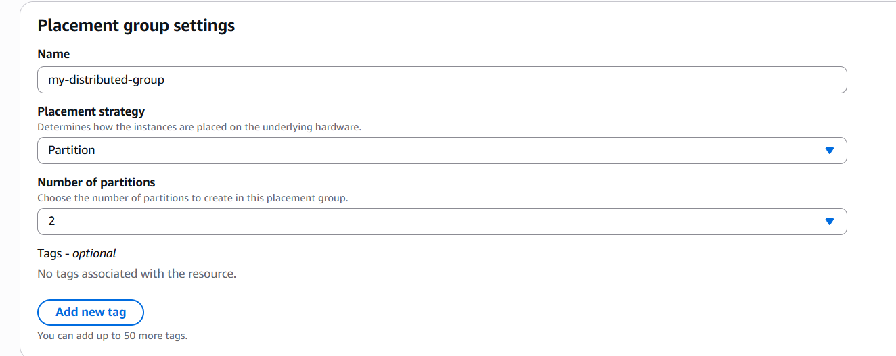
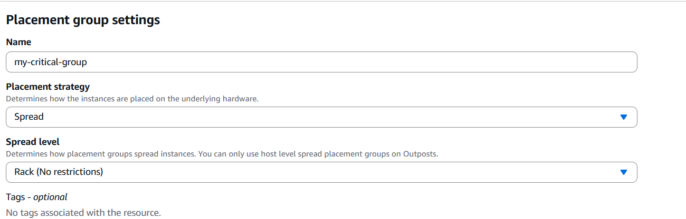
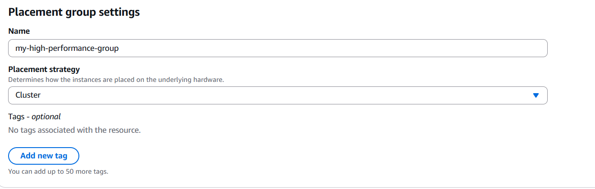

## EC2 Placement Groups Hands-On

### Project Overview

In this hands-on project, I created and explored Amazon EC2 Placement Groups to control how EC2 instances are physically placed on AWS infrastructure.

This exercise demonstrated how placement strategies can be used to optimise for performance, fault tolerance, and workload isolation depending on application requirements.

---

## Objectives

- Create EC2 Placement Groups
- Understand the three placement strategies
- Configure Cluster Placement Groups
- Configure Spread Placement Groups
- Configure Partition Placement Groups
- Launch EC2 instances into specific placement groups
- Understand performance and availability trade-offs

---

## AWS Services Used

- Amazon Elastic Compute Cloud (EC2)
- EC2 Placement Groups

---

## Practical Tasks Completed

### Navigated to Placement Groups

Accessed the placement group configuration by navigating to:

- EC2 Console
- Network & Security
- Placement Groups
- Create Placement Group

### Created a Partition Placement Group

Created a placement group named `my-distributed-group` using the **Partition** strategy.

Configured:

- Number of partitions: 2

This strategy distributes instances across multiple logical partitions, each placed on separate hardware.

### Created a Spread Placement Group

Created a placement group named `my-critical-group` using the **Spread** strategy.

Configured:

- Spread level: Rack (No restrictions)

This strategy places each instance on distinct hardware to minimise the impact of a single hardware failure.

### Created a Cluster Placement Group

Created a placement group named `my-high-performance-group` using the **Cluster** strategy.

This strategy places instances physically close together within the same Availability Zone to achieve low latency and high network throughput.

### Launched Instances into Placement Groups

During EC2 instance creation, navigated to:

- Launch Instance
- Advanced Details
- Placement Group

Selected the desired placement group to control where the instance was deployed.

---

## Placement Strategy Summary

### Cluster Placement Group

Optimised for:

- Low network latency
- High throughput
- High-performance computing workloads

Common use cases:

- Big data analytics
- HPC applications
- Distributed databases

### Spread Placement Group

Optimised for:

- Maximum fault isolation

Common use cases:

- Critical applications
- Small numbers of important instances

### Partition Placement Group

Optimised for:

- Large distributed systems
- Reduced blast radius

Common use cases:

- Hadoop
- Kafka
- Cassandra

---

## Security and Availability Concepts Demonstrated

- Fault Isolation
- High Availability
- Infrastructure Resilience
- Low-Latency Networking
- Hardware Separation
- Workload Distribution

---

## Key Lessons Learned

- Placement Groups control how EC2 instances are physically placed on AWS infrastructure.
- Cluster placement groups provide the highest network performance.
- Spread placement groups maximise hardware isolation.
- Partition placement groups reduce the impact of hardware failures on distributed systems.
- Placement Groups can significantly improve application performance and resilience when used appropriately.

---

## Skills Demonstrated

- EC2 Infrastructure Design
- Placement Group Configuration
- High Availability Architecture
- Performance Optimisation
- Fault Tolerance Planning
- AWS Networking Concepts

---

## Screenshots

### Partition Placement Group

### Spread Placement Group

### Cluster Placement Group

---

## Outcome

Successfully created and configured Cluster, Spread, and Partition Placement Groups and learned how each strategy can be used to optimise EC2 deployments for performance, resilience, and workload isolation.

---

