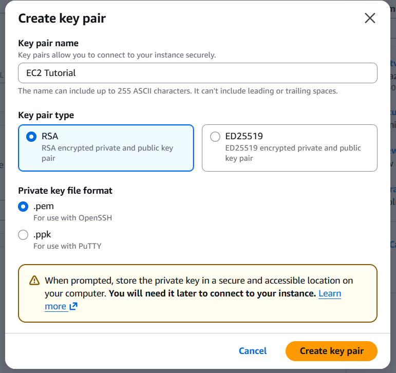
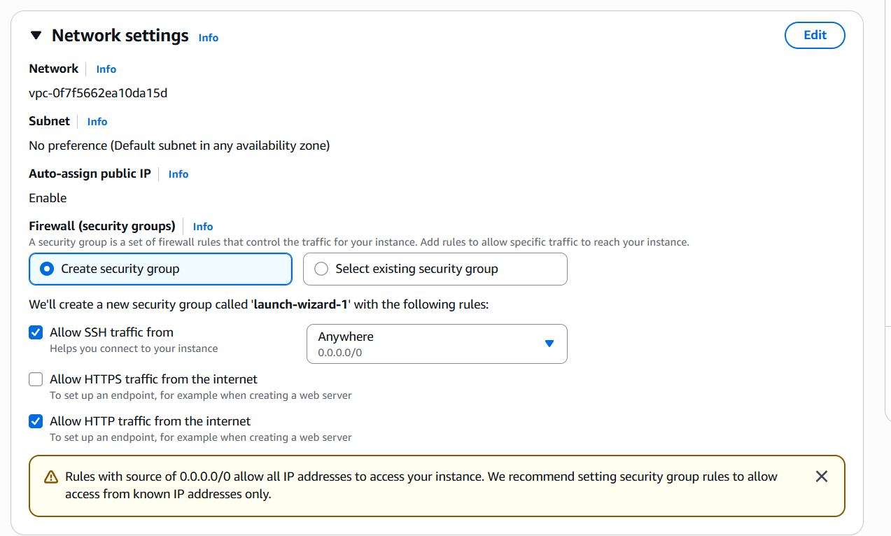
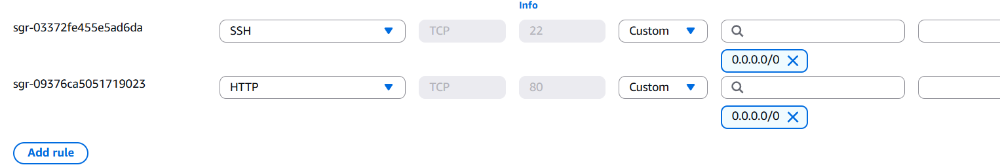

## EC2 Instance with User Data Hands-On

### Project Overview

In this hands-on project, I launched my first Amazon EC2 instance running Amazon Linux and used EC2 User Data to automatically deploy a simple web server during the instance's initial boot process.

This exercise demonstrated how cloud infrastructure can be provisioned in seconds and automatically configured using startup scripts, highlighting the power and scalability of Amazon EC2.

---

## Objectives

- Launch an Amazon EC2 instance
- Create and download an SSH key pair
- Configure security groups to allow SSH and HTTP access
- Use EC2 User Data to automate web server installation
- Access the web server using the instance's public IP address
- Understand the difference between public and private IP addresses

---

## AWS Services Used

- Amazon Elastic Compute Cloud (EC2)
- EC2 Key Pairs
- Security Groups
- EC2 User Data

---

## Practical Tasks Completed

### Launched an Amazon EC2 Instance

Created an Amazon Linux EC2 instance by navigating to:

- EC2 Console
- Instances
- Launch Instances

Configured:

- Instance name
- Amazon Linux AMI
- Instance type
- SSH key pair
- Security group
- Storage
- Advanced Details

### Created an SSH Key Pair

Generated a new key pair named `EC2 Tutorial`.

Configuration selected:

- Key pair type: RSA
- Private key format: `.pem`

The private key was downloaded and stored securely for future SSH access.

### Configured Security Groups

Created a security group with the following inbound rules:

- SSH (Port 22) from Anywhere (`0.0.0.0/0`)
- HTTP (Port 80) from Anywhere (`0.0.0.0/0`)

This allowed:

- Secure remote access to the server
- Public access to the hosted website

### Used EC2 User Data

Added a startup script in the **User Data** section under Advanced Details.

User Data allows commands to run automatically the first time the instance boots.

Typical use cases include:

- Installing software packages
- Configuring services
- Creating files
- Deploying applications

### Automatically Deployed a Web Server

Used User Data to install and start a web server automatically.

This meant the instance was fully configured and serving content immediately after launch without manual setup.

### Accessed the Website

Opened the EC2 instance’s public IPv4 address in a web browser and verified that the website was available.

### Reviewed Instance Networking Information

Examined key networking details, including:

- Instance ID
- Public IPv4 address
- Private IPv4 address

The public IP is used to access the instance from the internet.

The private IP is used for internal communication within the AWS network.

---

## Security Concepts Demonstrated

- SSH Key-Based Authentication
- Security Groups as Virtual Firewalls
- Public vs Private IP Addressing
- Automated Server Configuration
- Infrastructure Provisioning
- Least Privilege Access

---

## Key Lessons Learned

- Amazon EC2 instances can be launched and configured in seconds.
- User Data automates software installation and server setup during the first boot.
- Security groups control inbound network access to EC2 instances.
- SSH access requires a securely stored private key.
- Public IP addresses enable internet access, while private IP addresses are used internally within AWS.
- Cloud computing allows rapid infrastructure provisioning without owning physical servers.

---

## Skills Demonstrated

- EC2 Provisioning
- User Data Automation
- Security Group Configuration
- SSH Key Management
- Web Server Deployment
- AWS Networking Fundamentals

---

## Screenshots

### EC2 Key Pair Creation

### EC2 Network and Security Group Configuration

---

## Outcome

Successfully launched an Amazon EC2 instance, configured security groups, generated SSH credentials, and used EC2 User Data to automatically deploy a web server accessible over the internet.

## Security Groups Hands-On

### Project Overview

In this hands-on project, I explored Amazon EC2 Security Groups and examined how they control inbound and outbound network traffic to EC2 instances.

This exercise demonstrated how security groups act as virtual firewalls, allowing administrators to define which ports and protocols are permitted to access cloud resources.

---

## Objectives

- Navigate to the Security Groups section in the EC2 console
- Review inbound and outbound rules
- Understand how port-based access control works
- Configure SSH and HTTP access rules
- Learn how `0.0.0.0/0` affects network exposure
- Troubleshoot connectivity issues caused by restrictive rules

---

## AWS Services Used

- Amazon Elastic Compute Cloud (EC2)
- Security Groups

---

## Practical Tasks Completed

### Accessed the Security Group

Navigated to:

- EC2 Console
- Network & Security
- Security Groups

Selected the security group associated with the EC2 instance (`launch-wizard-1`).

### Reviewed Inbound Rules

Examined the configured inbound rules:

- SSH (TCP Port 22) from `0.0.0.0/0`
- HTTP (TCP Port 80) from `0.0.0.0/0`

These rules allow:

- SSH access from any IP address on the internet
- Web traffic from any IP address on the internet

### Understood `0.0.0.0/0`

Learned that `0.0.0.0/0` represents all IPv4 addresses.

This means any device on the internet can attempt to connect to the specified ports.

### Reviewed Outbound Rules

Observed that security groups also contain outbound rules that control traffic leaving the EC2 instance.

By default, AWS allows all outbound traffic.

### Troubleshot Connection Timeouts

Learned that if SSH or HTTP connections time out, the security group configuration should be checked to confirm that the required ports are open.

---

## Security Concepts Demonstrated

- Security Groups as Stateful Firewalls
- Port-Based Access Control
- Inbound and Outbound Traffic Filtering
- Public Internet Exposure
- Principle of Least Privilege
- Network Troubleshooting

---

## Key Lessons Learned

- Security groups act as virtual firewalls for EC2 instances.
- Inbound rules control which traffic is allowed to reach an instance.
- Outbound rules control which traffic is allowed to leave an instance.
- `0.0.0.0/0` permits access from anywhere on the internet.
- Misconfigured security groups are a common cause of connection failures.
- Access should be restricted to trusted IP addresses whenever possible.

---

## Skills Demonstrated

- Security Group Configuration
- Network Access Control
- Port and Protocol Management
- Connectivity Troubleshooting
- AWS Networking Fundamentals
- Infrastructure Security

---

## Screenshots

### Security Group Inbound Rules

---

## Outcome

Successfully reviewed and analysed EC2 security group rules, including SSH and HTTP access, and gained practical understanding of how AWS controls network connectivity to cloud resources.

---

This project demonstrated the ability to provision and configure cloud infrastructure rapidly using AWS.

---
