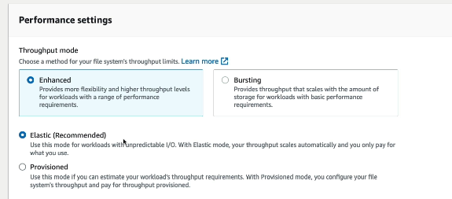
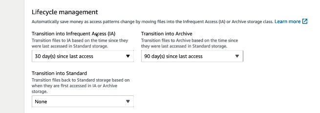
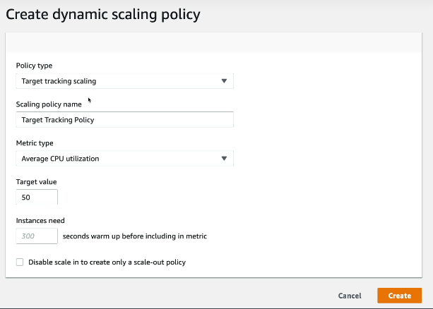
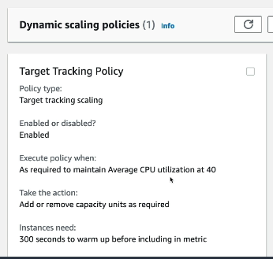

## Amazon EBS Hands-On

### Project Overview

In this hands-on project, I explored Amazon Elastic Block Store (EBS) volumes and learned how to create, attach, and manage persistent block storage for EC2 instances.

This exercise demonstrated how EBS volumes provide durable storage that can be attached to EC2 instances, and how the "Delete on Termination" setting determines whether volumes are preserved when an instance is terminated.

---

## Objectives

- Review EBS volumes attached to an EC2 instance
- Navigate to the EBS Volumes console
- Create a new EBS volume
- Ensure the volume is created in the correct Availability Zone
- Attach the volume to an EC2 instance
- Verify multiple volumes are attached
- Understand volume persistence after instance termination
- Review the Delete on Termination setting

---

## AWS Services Used

- Amazon Elastic Compute Cloud (EC2)
- Amazon Elastic Block Store (EBS)

---

## Practical Tasks Completed

### Reviewed Existing EC2 Storage

Selected an existing EC2 instance and navigated to:

- EC2 Console
- Instances
- Select Instance
- Storage Tab

Viewed the root EBS volume already attached to the instance.

### Accessed the EBS Volumes Console

Navigated to:

- EC2 Console
- Elastic Block Store
- Volumes

Reviewed all EBS volumes available in the AWS account.

### Created a New EBS Volume

Created an additional EBS volume with the following configuration:

- Volume Type: General Purpose SSD (gp3 or gp2)
- Size: Custom
- Availability Zone: Same as the target EC2 instance

### Attached the Volume to the EC2 Instance

Attached the newly created volume by selecting:

- Actions
- Attach Volume
- Select EC2 Instance
- Confirm Attachment

### Verified Multiple Volumes

Returned to the EC2 instance Storage tab and confirmed that both:

- Root volume
- Additional EBS volume

were attached to the instance.

### Reviewed Availability Zone Requirement

Confirmed that EBS volumes must be created in the same Availability Zone as the EC2 instance.

If the volume is created in a different Availability Zone, it cannot be attached.

### Investigated Delete on Termination

Reviewed the `Delete on Termination` attribute for the root volume.

This setting determines whether the volume is automatically deleted when the EC2 instance is terminated.

- Enabled: Volume is deleted
- Disabled: Volume is preserved

---

## Storage Concepts Demonstrated

- Block Storage
- Persistent Storage
- Root and Additional Volumes
- Availability Zone Constraints
- Volume Attachment
- Data Retention
- Delete on Termination

---

## Key Lessons Learned

- EBS provides persistent block storage for EC2 instances.
- Additional volumes can be created and attached at any time.
- Volumes must reside in the same Availability Zone as the target instance.
- Data stored on EBS persists independently of the EC2 instance unless configured otherwise.
- The Delete on Termination setting controls whether volumes are retained after instance deletion.
- Preserving volumes is useful for backups, recovery, and data retention.

---

## Skills Demonstrated

- EBS Volume Creation
- EC2 Storage Management
- Volume Attachment and Verification
- Availability Zone Planning
- Data Persistence Configuration
- AWS Infrastructure Administration

---
## Outcome

## Amazon EBS Snapshots Hands-On

### Project Overview

In this hands-on project, I created Amazon EBS Snapshots to back up EBS volumes, copied snapshots to other AWS Regions, restored volumes from snapshots, and configured the AWS Recycle Bin to protect snapshots from accidental deletion.

This exercise demonstrated how AWS provides durable, point-in-time backups and disaster recovery capabilities for EC2 storage.

---

## Objectives

- Create point-in-time EBS snapshots
- View and manage snapshots in the AWS Console
- Copy snapshots to another AWS Region
- Restore new EBS volumes from snapshots
- Configure AWS Recycle Bin retention rules
- Recover accidentally deleted snapshots

---

## AWS Services Used

- Amazon Elastic Block Store (EBS)
- Amazon EBS Snapshots
- AWS Recycle Bin
- Amazon EC2

---

## Practical Tasks Completed

### Created an EBS Snapshot

Created a snapshot from an existing EBS volume by navigating to:

- EC2 Console
- Volumes
- Select Volume
- Actions
- Create Snapshot

This generated a point-in-time backup of the selected EBS volume.

### Viewed Existing Snapshots

Navigated to:

- EC2 Console
- Elastic Block Store
- Snapshots

Reviewed all snapshots stored in the AWS account.

### Copied a Snapshot to Another Region

Selected a snapshot and chose:

- Actions
- Copy Snapshot

Specified a destination AWS Region.

This is useful for:

- Disaster recovery
- Geographic redundancy
- Cross-region backups

### Restored a Volume from a Snapshot

Created a new EBS volume from a snapshot by selecting:

- Snapshots
- Select Snapshot
- Actions
- Create Volume from Snapshot

Configured:

- Volume type
- Size
- Availability Zone

Verified that the restored volume appeared in the Volumes section.

### Configured AWS Recycle Bin

Navigated to:

- AWS Recycle Bin

Created a retention rule to protect EBS snapshots from permanent deletion.

Configured:

- Resource type: EBS Snapshots
- Retention period: Custom duration

### Deleted and Recovered a Snapshot

Deleted a snapshot and confirmed that it was moved to the Recycle Bin.

Recovered the snapshot from the Recycle Bin, demonstrating protection against accidental deletion.

---

## Backup and Recovery Concepts Demonstrated

- Point-in-Time Backups
- Snapshot-Based Recovery
- Cross-Region Replication
- Disaster Recovery
- Data Retention Policies
- Accidental Deletion Protection

---

## Key Lessons Learned

- EBS snapshots provide incremental point-in-time backups of EBS volumes.
- Snapshots can be copied to other AWS Regions for disaster recovery.
- New EBS volumes can be restored directly from snapshots.
- AWS Recycle Bin protects snapshots from accidental deletion.
- Retention rules provide additional backup safety and governance.
- Snapshot-based backups are a core component of resilient AWS architectures.

---

## Skills Demonstrated

- EBS Snapshot Creation
- Cross-Region Backup Management
- Volume Restoration
- Disaster Recovery Planning
- AWS Recycle Bin Configuration
- Data Protection Administration

---
## Outcome

Successfully created EBS snapshots, copied them across regions, restored new volumes, and configured AWS Recycle Bin to protect backups from accidental deletion.

---
## Amazon Machine Images (AMI) Hands-On

### Project Overview

In this hands-on project, I created a custom Amazon Machine Image (AMI) from an existing EC2 instance and used it to launch new EC2 instances with the same operating system, applications, and configuration.

This exercise demonstrated how AMIs can be used to rapidly deploy preconfigured servers, significantly reducing setup time and ensuring consistency across environments.

---

## Objectives

- Launch and configure an EC2 instance
- Create a custom AMI from the configured instance
- View custom AMIs in the AWS Console
- Launch new EC2 instances from the custom AMI
- Understand how AMIs speed up deployments
- Reuse application and operating system configurations

---

## AWS Services Used

- Amazon Elastic Compute Cloud (EC2)
- Amazon Machine Images (AMI)
- Amazon Elastic Block Store (EBS)

---

## Practical Tasks Completed

### Launched and Configured an EC2 Instance

Created an EC2 instance and configured:

- Key pair
- Security groups
- Storage
- User data scripts
- Installed applications

This instance served as the base system for the custom AMI.

### Created a Custom AMI

Created an image from the configured EC2 instance by navigating to:

- EC2 Console
- Instances
- Select Instance
- Image and Templates
- Create Image

Provided a name and description, then initiated image creation.

### Verified AMI Creation

Navigated to:

- EC2 Console
- Images
- AMIs

Confirmed the newly created AMI appeared in the **My AMIs** section after reaching the `Available` state.

### Launched a New Instance from the AMI

Created a new EC2 instance and selected the custom image under:

- Application and OS Images
- My AMIs

The new instance inherited:

- Operating system configuration
- Installed software
- Security settings
- Preconfigured user data and applications

### Observed Faster Deployment

Verified that launching from the AMI was significantly faster than rebuilding the server manually, as all customisations were already included.

---

## Infrastructure Concepts Demonstrated

- Golden Images
- Immutable Infrastructure
- Rapid Provisioning
- Configuration Standardisation
- Pre-Baked Server Templates
- Scalable Deployments

---

## Key Lessons Learned

- AMIs are reusable templates containing the operating system and configuration of an EC2 instance.
- Custom AMIs enable consistent deployments across environments.
- Applications and settings are preserved in the image.
- Launching from an AMI is much faster than manually configuring a new server.
- AMIs form the foundation of Auto Scaling Groups and automated infrastructure.

---

## Skills Demonstrated

- EC2 Instance Configuration
- AMI Creation and Management
- Infrastructure Standardisation
- Rapid Server Deployment
- Immutable Infrastructure Concepts
- AWS Automation Foundations

---

## Outcome

Successfully created a custom Amazon Machine Image (AMI) from a configured EC2 instance and used it to launch new preconfigured instances, demonstrating rapid and consistent server deployment.

---
## Amazon Elastic File System (EFS) Hands-On

### Project Overview

In this hands-on project, I created an Amazon Elastic File System (EFS), configured lifecycle policies to automatically transition files to lower-cost storage classes, and mounted the file system to EC2 instances.

This exercise demonstrated how EFS provides scalable, shared file storage that can be accessed simultaneously by multiple EC2 instances across multiple Availability Zones.

---

## Objectives

- Create an Amazon EFS file system
- Configure lifecycle management policies
- Select throughput and performance settings
- Configure mount targets within a VPC
- Associate security groups with EFS mount targets
- Launch EC2 instances with EFS attached
- Understand shared storage across multiple EC2 instances

---

## AWS Services Used

- Amazon Elastic File System (EFS)
- Amazon Elastic Compute Cloud (EC2)
- Amazon Virtual Private Cloud (VPC)
- Security Groups

---

## Practical Tasks Completed

### Created an EFS File System

Created a new file system by navigating to:

- EFS Console
- Create File System
- Customise

Configured:

- File system type: Regional
- Lifecycle management policies
- Performance settings
- Network settings

### Configured Lifecycle Management

Configured automatic storage transitions to reduce costs:

- Transition to Infrequent Access (IA): 30 days since last access
- Transition to Archive: 90 days since last access

These settings automatically move infrequently accessed files to lower-cost storage classes.

### Selected Throughput Settings

Configured the following performance options:

- Throughput mode: Enhanced
- Throughput setting: Elastic (Recommended)

This configuration automatically scales throughput based on workload demand and charges only for the throughput used.

### Configured Network Access

Selected:

- Target VPC
- Automatically created mount targets in multiple Availability Zones
- Security groups allowing NFS access over port 2049

### Created Mount Targets

AWS automatically created mount targets in multiple Availability Zones to provide highly available access to the file system.

### Launched EC2 Instances with EFS

Created EC2 instances and configured them to mount the EFS file system.

This allowed multiple instances to access the same shared storage concurrently.

### Verified Security Group Associations

Reviewed the EFS Network tab and confirmed that security groups were attached to each mount target.

---

## Storage Concepts Demonstrated

- Shared File Storage
- Managed NFS
- Multi-AZ High Availability
- Lifecycle Management
- Elastic Throughput
- Cost Optimisation
- Centralised Storage

---

## Key Lessons Learned

- Amazon EFS provides fully managed, scalable shared file storage.
- Multiple EC2 instances can read and write to the same file system simultaneously.
- Lifecycle policies reduce costs by moving cold data to IA and Archive storage classes.
- Elastic throughput automatically scales based on workload demand.
- Security groups control access to EFS using NFS on port 2049.
- Regional EFS creates mount targets across multiple Availability Zones for resilience.

---

## Skills Demonstrated

- EFS File System Creation
- Lifecycle Policy Configuration
- Shared Storage Architecture
- Throughput Optimisation
- Security Group Configuration
- AWS Cost Optimisation

---

## Screenshots

### EFS Throughput Settings

### EFS Lifecycle Management

---

## Outcome

Successfully created and configured Amazon EFS, enabled lifecycle policies for automated cost optimisation, and mounted the file system to EC2 instances to provide highly available shared storage.

---
## Network Load Balancer (NLB) Hands-On

### Project Overview

In this hands-on project, I created an AWS Network Load Balancer (NLB), configured a TCP target group, registered EC2 instances, and performed health checks to verify backend availability.

This exercise demonstrated how NLBs operate at Layer 4 of the OSI model, providing extremely high-performance load balancing while preserving client source IP addresses.

---

## Objectives

- Create a Network Load Balancer (NLB)
- Configure listeners on TCP port 80
- Create a target group
- Register EC2 instances as targets
- Configure HTTP health checks
- Troubleshoot unhealthy targets
- Update security groups to allow health check traffic

---

## AWS Services Used

- Elastic Load Balancing (ELB)
- Network Load Balancer (NLB)
- Amazon EC2
- Target Groups
- Security Groups

---

## Practical Tasks Completed

### Created a Network Load Balancer

Created a new Network Load Balancer by navigating to:

- EC2 Console
- Load Balancers
- Create Load Balancer
- Network Load Balancer

Configured:

- Internet-facing load balancer
- Multiple Availability Zones
- One subnet per Availability Zone
- Static IPv4 addresses for each subnet

### Attached Security Groups

Associated a security group with the NLB to control inbound traffic.

Configured rules to allow:

- HTTP (TCP port 80)
- SSH (TCP port 22) where required for administration

### Created a Target Group

Created a target group with the following settings:

- Target type: Instances
- Protocol: TCP
- Port: 80
- Health check protocol: HTTP

### Registered EC2 Instances

Added web server EC2 instances as targets in the target group.

### Created the Load Balancer

Attached the target group to the listener and completed the NLB creation process.

### Monitored Target Health

Reviewed the Target Group health status and observed that health checks initially reported targets as unhealthy.

### Resolved Health Check Failures

Identified that security group rules were preventing HTTP health check requests.

Added an additional inbound rule to allow:

- HTTP (TCP port 80) from the appropriate source

After updating the security group, target health changed to healthy.

---

## Load Balancing Concepts Demonstrated

- Layer 4 Load Balancing
- Static IP Addresses
- Target Groups
- Health Checks
- Security Group Troubleshooting
- High Availability
- Source IP Preservation

---

## Key Lessons Learned

- Network Load Balancers operate at the transport layer (Layer 4).
- NLBs provide one static IP address per Availability Zone.
- Target groups define the backend instances that receive traffic.
- Health checks determine whether targets are eligible to receive requests.
- Security groups must allow health check traffic to avoid unhealthy targets.
- NLBs are designed for high throughput and low latency workloads.

---

## Skills Demonstrated

- Network Load Balancer Configuration
- Target Group Creation
- Health Check Troubleshooting
- Security Group Management
- High Availability Architecture
- AWS Load Balancing

---
## Outcome

Successfully created a Network Load Balancer, registered EC2 instances, and resolved health check failures by updating security group rules to allow HTTP traffic.

---
## Application Load Balancer (ALB) SSL Certificates Hands-On

### Project Overview

In this hands-on project, I configured HTTPS listeners on an Application Load Balancer (ALB) and explored how SSL/TLS certificates are used to encrypt traffic between clients and the load balancer.

This exercise demonstrated how AWS Certificate Manager (ACM) integrates with Elastic Load Balancing to provide secure web traffic using HTTPS.

---

## Objectives

- Review Application Load Balancer listeners
- Add an HTTPS listener
- Attach an SSL/TLS certificate
- Configure secure listener settings
- Forward encrypted traffic to target groups
- Understand SSL termination

---

## AWS Services Used

- Elastic Load Balancing (ELB)
- Application Load Balancer (ALB)
- AWS Certificate Manager (ACM)
- Target Groups

---

## Practical Tasks Completed

### Reviewed Existing Application Load Balancer

Opened the Application Load Balancer and examined its current listener configuration.

### Added a New HTTPS Listener

Added an additional listener to the load balancer.

Configured:

- Protocol: HTTPS
- Port: 443

### Attached an SSL/TLS Certificate

Selected an SSL/TLS certificate from AWS Certificate Manager (ACM) to enable encrypted communication.

### Configured Secure Listener Settings

Reviewed HTTPS listener options, including:

- Security policies
- Supported TLS versions
- Cipher suites
- Server Name Indication (SNI)

### Configured Forwarding Rules

Set the HTTPS listener to forward requests to a specified target group containing EC2 instances.

### Implemented SSL Termination

Configured the ALB to decrypt HTTPS traffic before forwarding requests to backend instances.

---

## Security Concepts Demonstrated

- SSL/TLS Encryption
- HTTPS
- Certificate Management
- SSL Termination
- Secure Listener Configuration
- Server Name Indication (SNI)

---

## Key Lessons Learned

- HTTPS encrypts data in transit between clients and the load balancer.
- SSL/TLS certificates verify server identity and enable secure connections.
- AWS Certificate Manager simplifies certificate management.
- Application Load Balancers can terminate SSL connections.
- HTTPS listeners forward decrypted traffic to backend target groups.
- Security policies control which TLS versions and ciphers are permitted.

---

## Skills Demonstrated

- HTTPS Listener Configuration
- SSL/TLS Certificate Attachment
- AWS Certificate Manager Integration
- Secure Load Balancer Configuration
- TLS Policy Management
- Application Security

---

## Outcome

Successfully configured an HTTPS listener on an Application Load Balancer and attached an SSL/TLS certificate to enable secure encrypted web traffic.

---

- Configured Amazon EFS with Elastic throughput and lifecycle policies, enabling highly available shared storage and automated cost optimisation across multiple EC2 instances.

## Auto Scaling Groups Hands-On

### Project Overview

In this hands-on project, I created an AWS Auto Scaling Group (ASG) using a launch template and integrated it with an existing Application Load Balancer (ALB).

This exercise demonstrated how AWS automatically launches and replaces EC2 instances to maintain application availability and scalability.

---

## Objectives

- Create a launch template
- Configure EC2 instance settings
- Create an Auto Scaling Group
- Select multiple Availability Zones
- Attach the Auto Scaling Group to an existing load balancer
- Enable ELB health checks
- Monitor scaling activities

---

## AWS Services Used

- Amazon EC2
- EC2 Launch Templates
- Auto Scaling Groups (ASG)
- Application Load Balancer (ALB)
- Elastic Load Balancing (ELB)

---

## Practical Tasks Completed

### Removed Existing Instances

Terminated previously created EC2 instances to prepare for automated instance management through Auto Scaling.

### Created a Launch Template

Created a reusable launch template containing:

- Template name
- Amazon Linux AMI
- Instance type (`t2.micro`)
- EC2 key pair
- Existing security group
- User data script to automatically configure the instance

### Created an Auto Scaling Group

Created an Auto Scaling Group using the launch template.

Configured:

- Multiple Availability Zones
- Desired capacity
- Minimum capacity
- Maximum capacity

### Enabled Load Balancing

Attached the Auto Scaling Group to an existing Application Load Balancer.

This ensured traffic would be distributed across automatically launched instances.

### Enabled ELB Health Checks

Configured the Auto Scaling Group to use Elastic Load Balancing health checks.

If an instance failed health checks, AWS automatically terminated and replaced it.

### Reviewed Group Activities

Opened the Auto Scaling Group and monitored:

- Launch events
- Termination events
- Health check replacements

---

## Scaling Concepts Demonstrated

- Automated Instance Provisioning
- Self-Healing Infrastructure
- High Availability
- Launch Templates
- Health-Based Replacement
- Horizontal Scaling

---

## Key Lessons Learned

- Launch templates provide reusable EC2 configuration settings.
- Auto Scaling Groups automatically maintain the desired number of instances.
- ELB health checks allow AWS to detect and replace unhealthy instances.
- Auto Scaling improves resilience by reducing manual intervention.
- Integrating ASGs with load balancers provides scalable and fault-tolerant architectures.

---

## Skills Demonstrated

- Launch Template Configuration
- Auto Scaling Group Creation
- Load Balancer Integration
- Health Check Configuration
- High Availability Architecture
- Scalable Infrastructure Design

---

## Outcome

Successfully created an Auto Scaling Group using a launch template, integrated it with an Application Load Balancer, and enabled automatic instance replacement based on health checks.

---
## Auto Scaling Groups Scaling Policies Hands-On

### Project Overview

In this hands-on project, I configured scaling policies for an existing AWS Auto Scaling Group (ASG), focusing on dynamic scaling using target tracking policies based on CPU utilisation.

This exercise demonstrated how AWS can automatically increase or decrease the number of EC2 instances in response to changing demand.

---

## Objectives

- Review available Auto Scaling policy types
- Explore scheduled scaling
- Explore predictive scaling
- Create a dynamic scaling policy
- Configure target tracking based on CPU utilisation
- Set a target CPU threshold
- Configure instance warm-up time
- Monitor policy creation and operation

---

## AWS Services Used

- Amazon EC2 Auto Scaling
- Amazon CloudWatch
- Amazon EC2

---

## Practical Tasks Completed

### Reviewed Scaling Policy Types

Opened an existing Auto Scaling Group and explored the available scaling options:

- Scheduled Scaling
- Predictive Scaling
- Dynamic Scaling

### Explored Scheduled Scaling

Reviewed scheduled actions, which allow capacity changes to occur automatically at predefined dates and times.

### Explored Predictive Scaling

Reviewed predictive scaling, which uses historical usage data and machine learning to forecast future demand.

### Created a Dynamic Scaling Policy

Created a target tracking scaling policy with the following configuration:

- Policy type: Target Tracking Scaling
- Metric type: Average CPU Utilisation
- Target value: 50%
- Instance warm-up time: 300 seconds

### Enabled Automatic Capacity Adjustment

Configured the Auto Scaling Group to automatically:

- Launch additional EC2 instances when CPU utilisation exceeded the target threshold
- Terminate excess instances when utilisation decreased

### Verified Scaling Policy Creation

Confirmed that the policy was enabled and configured to maintain the target CPU utilisation automatically.

---

## Scaling Concepts Demonstrated

- Dynamic Scaling
- Target Tracking Policies
- Scheduled Scaling
- Predictive Scaling
- CPU-Based Scaling
- Instance Warm-Up
- Automatic Capacity Management

---

## Key Lessons Learned

- Dynamic scaling automatically adjusts capacity based on real-time metrics.
- Target tracking policies simplify scaling by maintaining a specified metric value.
- Scheduled scaling is useful for predictable traffic patterns.
- Predictive scaling uses historical trends to forecast future demand.
- Warm-up periods prevent newly launched instances from affecting scaling decisions too early.
- CloudWatch metrics drive scaling decisions automatically.

---

## Skills Demonstrated

- Auto Scaling Policy Configuration
- CloudWatch Metric Integration
- CPU-Based Capacity Management
- Dynamic Infrastructure Scaling
- Performance Optimisation
- AWS Automation

---

## Screenshots

### Dynamic Scaling Policy Configuration

### Target Tracking Policy Summary

---

## Outcome

Successfully configured a target tracking scaling policy that automatically adjusted EC2 capacity to maintain a target average CPU utilisation.

---
