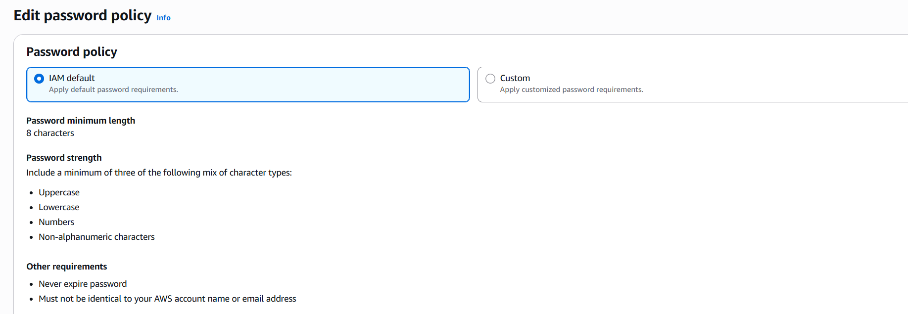
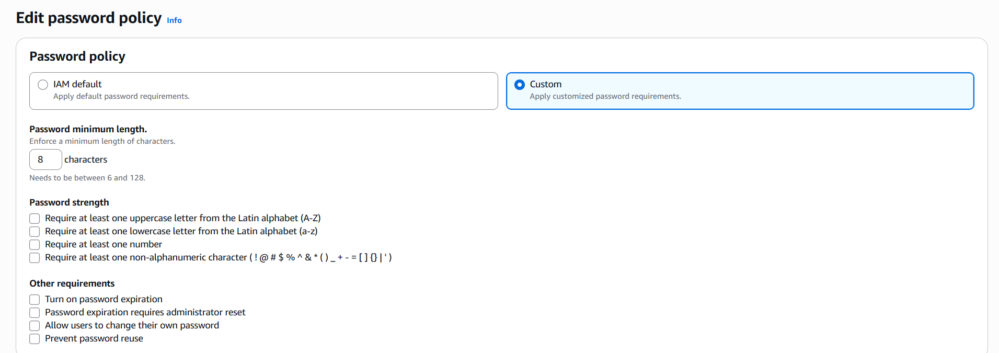
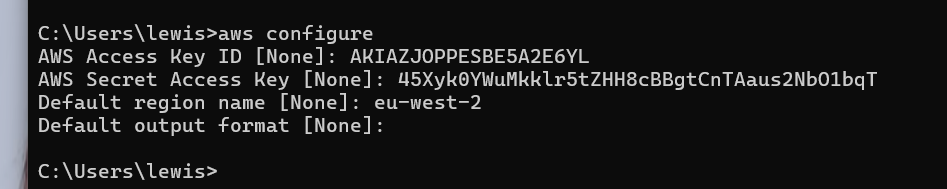
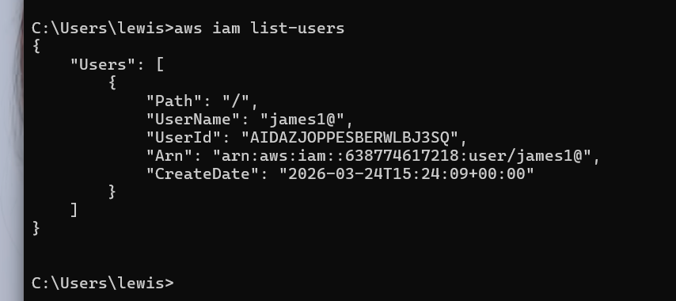

# IAM Policies Hands-On

## Project Overview

In this hands-on project, I explored how AWS Identity and Access Management (IAM) policies are used to control access to AWS resources. I removed overly permissive administrator access, attached read-only policies, created user groups, and analysed the JSON structure of AWS-managed policies.

This project demonstrates how AWS implements the Principle of Least Privilege and how permissions can be assigned directly to users or inherited through group membership.

---

## Objectives

- Remove AdministratorAccess from an IAM user
- Attach the IAMReadOnlyAccess managed policy
- Create an IAM group and assign permissions
- Review policy summaries and JSON documents
- Understand wildcard permissions (`*`)
- Create custom policies using the Visual and JSON editors

---

## AWS Services Used

- AWS Identity and Access Management (IAM)

---

## Practical Tasks Completed

### 1. Removed Administrator Access

I removed the `AdministratorAccess` policy from an IAM user to reduce excessive permissions.

### 2. Attached IAM Read-Only Access

I attached the AWS-managed `IAMReadOnlyAccess` policy directly to the user.

This policy allows the user to:
- View IAM users, groups, roles, and policies
- Read configuration details
- Perform `Get*` and `List*` actions

This policy does **not** allow the user to create, modify, or delete resources.

### 3. Created an IAM Group

I created an IAM group named `Developers`.

### 4. Added the User to the Group

I added the IAM user to the `Developers` group.

### 5. Attached Policies to the Group

I attached additional policies to the group, demonstrating how users inherit permissions through group membership.

### 6. Reviewed Policy Summary and JSON

I analysed AWS-managed policy JSON documents to understand how permissions are defined.

#### Administrator Access Example

json
{
  "Effect": "Allow",
  "Action": "*",
  "Resource": "*"
}

---

## Security Concepts Demonstrated

- Principle of Least Privilege
- Managed Policies vs Inline Policies
- Group-Based Access Control
- Policy Inheritance
- Wildcard Permissions (`*`)
- Custom Policy Creation

---

## Key Lessons Learned

- IAM permissions can be attached directly to users or inherited through groups.
- Group-based access control simplifies permission management and scales more effectively.
- The wildcard (`*`) grants broad access and should be used with caution.
- AWS policies are written in JSON and define which actions are allowed or denied on specific resources.
- `Get*` and `List*` actions typically provide read-only access to AWS services.
- Custom policies can be created using either the Visual Editor or the JSON Editor.

---

## Skills Demonstrated

- AWS IAM Administration
- Access Control Design
- Principle of Least Privilege Implementation
- JSON Policy Analysis
- Group-Based Permission Management
- Security Best Practices

---

## Screenshots

### Attach IAM Read-Only Access


### Group Membership and Assigned Policies


### Administrator Access Policy JSON


### IAM Read-Only Policy JSON


---

## Outcome

By completing this project, I gained practical experience configuring IAM users, groups, and policies to securely manage access to AWS resources. I developed a strong understanding of how AWS evaluates permissions and how to apply least privilege principles to real-world cloud environments.

---

## IAM MFA Hands-On

### Project Overview

In this hands-on project, I configured AWS Identity and Access Management (IAM) password policies and enabled Multi-Factor Authentication (MFA) to strengthen account security.

This exercise demonstrated how AWS can enforce strong passwords and require an additional authentication factor, significantly reducing the risk of unauthorised access to privileged accounts.

---

## Objectives

- Review AWS default password policy settings
- Configure a custom password policy
- Understand password complexity requirements
- Enable Multi-Factor Authentication (MFA) for the root account
- Configure a virtual authenticator application
- Verify login using time-based one-time passcodes (TOTP)

---

## AWS Services Used

- AWS Identity and Access Management (IAM)

---

## Practical Tasks Completed

### Reviewed Default Password Policy

Examined the AWS-managed default password policy, which includes:

- Minimum password length of 8 characters
- Requirement for uppercase letters
- Requirement for lowercase letters
- Requirement for numbers
- Requirement for non-alphanumeric characters
- Passwords never expire by default

### Configured Custom Password Policy

Explored custom password policy settings, including:

- Minimum password length
- Password expiration
- Allowing users to change their own passwords
- Preventing password reuse

### Enabled Multi-Factor Authentication (MFA)

Configured MFA for the AWS root account by:

- Navigating to Security Credentials
- Selecting Assign MFA Device
- Choosing a Virtual Authenticator App
- Scanning the QR code using an authenticator application
- Entering two consecutive one-time passcodes

### Verified MFA Authentication

Confirmed that future logins required both:

- Username and password
- Time-based one-time passcode (TOTP)

---

## Security Concepts Demonstrated

- Multi-Factor Authentication (MFA)
- Defense in Depth
- Strong Password Policies
- Root Account Protection
- Time-Based One-Time Passwords (TOTP)

---

## Key Lessons Learned

- MFA provides an additional layer of security beyond passwords alone.
- The AWS root account should always have MFA enabled.
- Custom password policies help enforce strong credential standards.
- Virtual authenticator applications are a simple and effective MFA solution.
- Password complexity requirements reduce the likelihood of credential compromise.

---

## Skills Demonstrated

- IAM Security Configuration
- Password Policy Management
- MFA Setup and Verification
- Root Account Hardening
- Security Best Practices

---

## Screenshots

### Default Password Policy


### Custom Password Policy


---

## Outcome

Successfully configured AWS password policies and enabled Multi-Factor Authentication to improve account security and protect privileged access.

---
## AWS CLI Hands-On

### Project Overview

In this hands-on project, I configured the AWS Command Line Interface (CLI) using IAM access keys and used it to interact with AWS services from the command line.

This exercise demonstrated how AWS can be managed programmatically and how IAM permissions control access whether using the AWS Management Console or the AWS CLI.

---

## Objectives

- Create IAM access keys for CLI-based programmatic access
- Configure the AWS CLI with an Access Key ID and Secret Access Key
- Set the default AWS region as `eu-west-2`
- Use CLI commands to interact with IAM
- Retrieve IAM user information from the command line
- Understand how IAM permissions affect both console and CLI access

---

## AWS Services Used

- AWS Identity and Access Management (IAM)
- AWS Command Line Interface (CLI)

---

## Practical Tasks Completed

### Created IAM Access Keys

Generated access keys for an IAM user to allow programmatic access from the AWS CLI.

The access key pair included:

- Access Key ID
- Secret Access Key

These credentials are used by the AWS CLI to authenticate requests to AWS services.

### Configured AWS CLI Credentials

Used the `aws configure` command to connect the local AWS CLI installation to the AWS account.

The configuration included:

- AWS Access Key ID
- AWS Secret Access Key
- Default region name: `eu-west-2`
- Default output format

### Ran IAM Commands from the CLI

Used the AWS CLI to run IAM commands and confirm that the configuration was working correctly.

### Listed IAM Users

The command used was:

```bash
aws iam list-users
```

### Retrieved IAM User Information

The `aws iam list-users` command returned IAM user details in JSON format.

The output included:

- Path
- UserName
- UserId
- ARN
- CreateDate

### Confirmed IAM Permission Behaviour

This lab showed that AWS CLI permissions are controlled by the same IAM policies used in the AWS Management Console.

If permissions are removed or restricted from the IAM user, those restrictions also apply when using the CLI.

---

## Security Concepts Demonstrated

- Programmatic Access
- IAM Access Keys
- Credential Security
- IAM Permission Enforcement
- Least Privilege
- Authentication and Authorization

---

## Key Lessons Learned

- The AWS CLI allows AWS services to be managed from the command line.
- Access keys are used to authenticate programmatic access to AWS.
- IAM permissions apply equally to both the AWS Console and AWS CLI.
- Restricting an IAM user’s permissions also restricts what they can do through the CLI.
- CLI output is commonly returned in JSON format, making it useful for automation.
- Access keys should be protected, rotated regularly, and not shared publicly.

---

## Skills Demonstrated

- AWS CLI Configuration
- IAM Access Key Management
- Command-Line AWS Administration
- Programmatic AWS Access
- JSON Output Interpretation
- Credential-Based Authentication

---

## Screenshots

### AWS CLI Configuration


### AWS CLI List Users Output


---

## Outcome

Successfully configured the AWS CLI using IAM access keys and verified programmatic access by retrieving IAM user information from the command line.

This confirmed that AWS resources can be managed through the CLI and that IAM policies control both console-based and command-line access.

---
