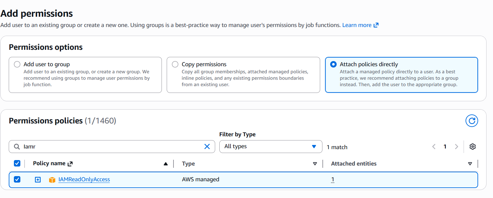
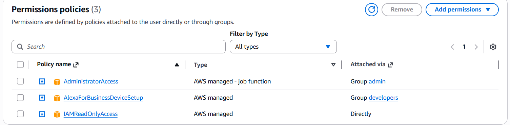
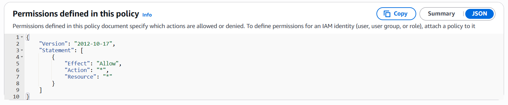
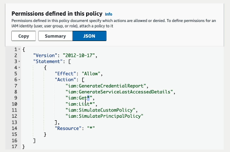

# IAM Policies Hands-On

## Project Overview

In this hands-on project, I explored how AWS Identity and Access Management (IAM) policies are used to control access to AWS resources. I removed overly permissive administrator access, attached read-only policies, created user groups, and analysed the JSON structure of AWS-managed policies.

This project demonstrates how AWS implements the Principle of Least Privilege and how permissions can be assigned directly to users or inherited through group membership.

---

## Objectives

- Remove AdministratorAccess from an IAM user
- Attach the IAMReadOnlyAccess managed policy
- Create an IAM group and assign permissions
- Review policy summaries and JSON documents
- Understand wildcard permissions (`*`)
- Create custom policies using the Visual and JSON editors

---

## AWS Services Used

- AWS Identity and Access Management (IAM)

---

## Practical Tasks Completed

### 1. Removed Administrator Access

I removed the `AdministratorAccess` policy from an IAM user to reduce excessive permissions.

### 2. Attached IAM Read-Only Access

I attached the AWS-managed `IAMReadOnlyAccess` policy directly to the user.

This policy allows the user to:
- View IAM users, groups, roles, and policies
- Read configuration details
- Perform `Get*` and `List*` actions

This policy does **not** allow the user to create, modify, or delete resources.

### 3. Created an IAM Group

I created an IAM group named `Developers`.

### 4. Added the User to the Group

I added the IAM user to the `Developers` group.

### 5. Attached Policies to the Group

I attached additional policies to the group, demonstrating how users inherit permissions through group membership.

### 6. Reviewed Policy Summary and JSON

I analysed AWS-managed policy JSON documents to understand how permissions are defined.

#### Administrator Access Example

json
{
  "Effect": "Allow",
  "Action": "*",
  "Resource": "*"
}

---

## Security Concepts Demonstrated

- Principle of Least Privilege
- Managed Policies vs Inline Policies
- Group-Based Access Control
- Policy Inheritance
- Wildcard Permissions (`*`)
- Custom Policy Creation

---

## Key Lessons Learned

- IAM permissions can be attached directly to users or inherited through groups.
- Group-based access control simplifies permission management and scales more effectively.
- The wildcard (`*`) grants broad access and should be used with caution.
- AWS policies are written in JSON and define which actions are allowed or denied on specific resources.
- `Get*` and `List*` actions typically provide read-only access to AWS services.
- Custom policies can be created using either the Visual Editor or the JSON Editor.

---

## Skills Demonstrated

- AWS IAM Administration
- Access Control Design
- Principle of Least Privilege Implementation
- JSON Policy Analysis
- Group-Based Permission Management
- Security Best Practices

---

## Screenshots

### Attach IAM Read-Only Access

### Group Membership and Assigned Policies

### Administrator Access Policy JSON

### IAM Read-Only Policy JSON

---

## Outcome

By completing this project, I gained practical experience configuring IAM users, groups, and policies to securely manage access to AWS resources. I developed a strong understanding of how AWS evaluates permissions and how to apply least privilege principles to real-world cloud environments.

---

## CV Bullet Point

Configured AWS IAM users, groups, and managed policies to implement least privilege access controls, analysed policy JSON documents, and created custom policies using both the Visual and JSON editors.
